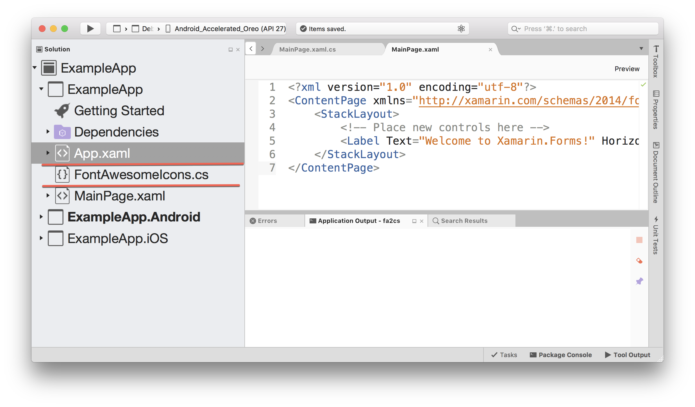

# About

**FontAwesome To C#** is a static C# class with string constants for all FontAwesome icon codes. 

**[Get FontAwesomeIcons.cs here](FontAwesomeIcons.cs)**

**[Download the FontAwesome font assets here](https://github.com/FortAwesome/Font-Awesome/tree/master/webfonts)**

# Benefits

Use FontAwesome To C# to replace confusing and arcane unicode strings with a clean and descriptive property.

This:

```
// Huh? What icon is this? What font is it from? 😭
submitButton.Text = "/uf00c";
```

Becomes this:

```
// Obviously a check icon from FontAwesome! 😊👍
submitButton.Text = FontAwesome.FontAwesomeIcons.Check;
```

The end result is cleaner, more readable and more maintainable code.

# Using FontAwesome To C#

It's super easy to use FontAwesome To C#!

Simply download [FontAwesomeIcons.cs](FontAwesomeIcons.cs) and place it into your project:



**Ensure that you have added the FontAwesome font files into your projects!**

You can use an icon in C# like:

```
var checkIcon = FontAwesome.FontAwesomeIcons.Check;
```

You can use an icon in XAML by:

 * Adding a namespace reference to `FontAwesome`: `xmlns:fontAwesome="clr-namespace:FontAwesome"`
 * Referencing a icon using `x:Static`: `<Label Text="{x:Static fontAwesome:FontAwesomeIcons.Check}"/>`

Voila! All done!

# Using Material Design Icons?

If you're using the Material Design icon set, [check out md2cs](https://github.com/matthewrdev/md2cs), a static class file containing string constants for all Material Design icon codes.

# Credits

 * [Font Awesome](https://fontawesome.com/): The amazing Font Awesome icon set.
 * [HtmlAgility Pack](https://html-agility-pack.net/): Used for crawling www.fontawesome.com 🙈
 * [QuickType](https://quicktype.io/): Used to generate a C# model to consume https://fontawesome.com/cheatsheet.
 * [Assembly Emitter](https://josephwoodward.co.uk/2016/12/in-memory-c-sharp-compilation-using-roslyn): Used to emit the FontAwesome.IconCodes assembly.
